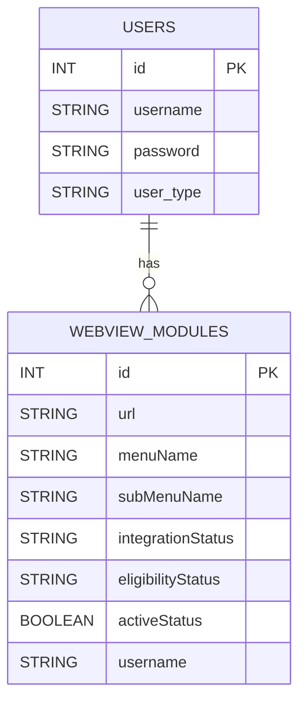

# Entity Relationship Diagram (ERD)

```mermaid
erDiagram
    USERS {
        INT id PK
        STRING username
        STRING password
        STRING user_type
    }
    WEBVIEW_MODULES {
        INT id PK
        STRING url
        STRING menuName
        STRING subMenuName
        STRING integrationStatus
        STRING eligibilityStatus
        BOOLEAN activeStatus
        STRING username
    }

    USERS ||--o{ WEBVIEW_MODULES : "has"
```

- Each user can have multiple webview modules.
- `user_id` in `WEBVIEW_MODULES` is a foreign key referencing `USERS(id)`.
